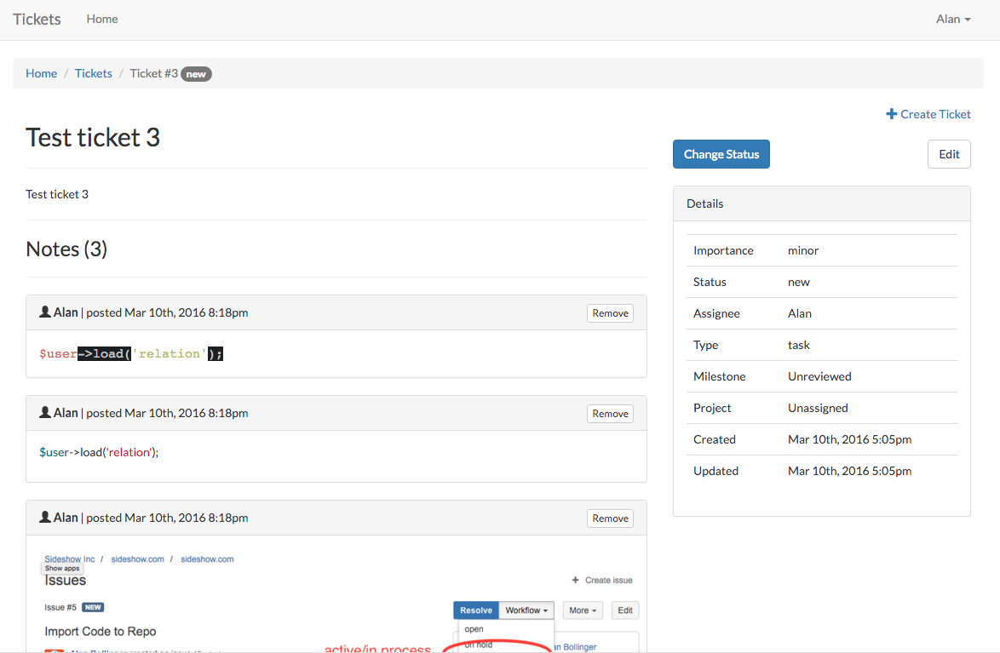
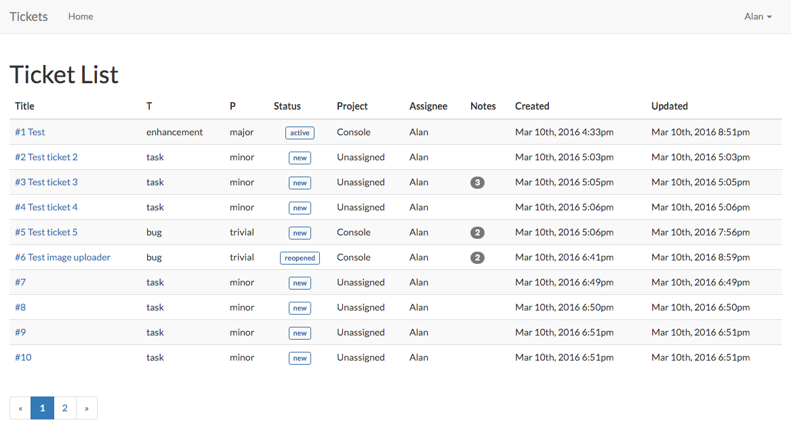
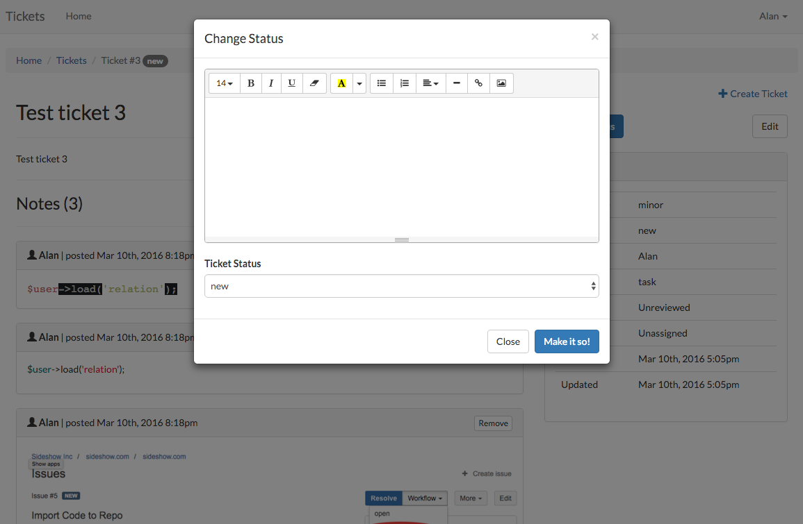
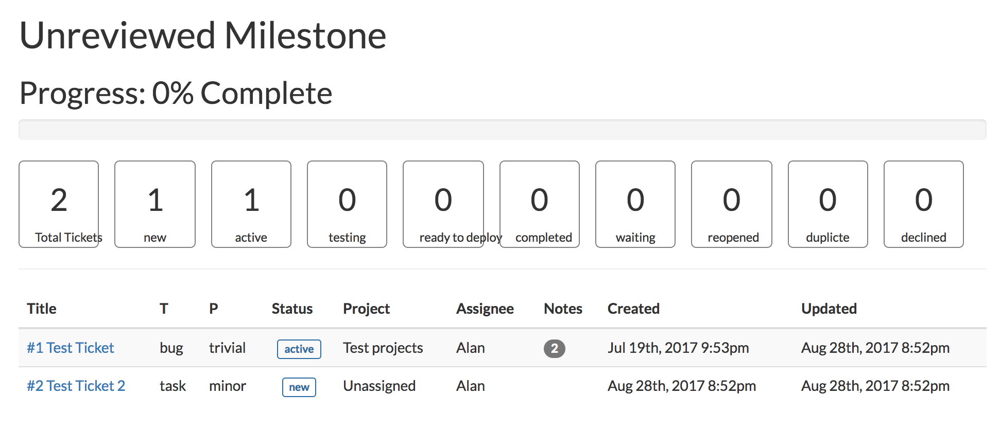

# Tickets!

A self-hosted, open-source agile ticket tracker for small teams who want Kanban boards, a knowledge base, real-time collaboration, and a REST API — without the overhead of Jira or the cost of Linear.

> **Built with [Laravel](https://laravel.com).** Tickets is proudly powered by the Laravel framework — its expressive syntax, robust ecosystem, and first-class tooling make it the backbone of this application.



## Quick Start

The fastest way to get running is Docker:

```bash
git clone https://github.com/velkymx/tickets.git
cd tickets
docker compose up -d --build
```

Open [http://localhost](http://localhost) and log in with the default administrator account. See [Installation](#installation) for manual setup or [Hosting](#hosting) for production deployment.

## Features

### Ticket Management
- Create, edit, clone, and batch-update tickets with full metadata (type, status, importance, project, milestone, assignee, due date, story points, estimates)
- Kanban board with drag-and-drop status changes (powered by SortableJS)
- Multi-filter list view with search, pagination, and per-page control
- CSV import for bulk ticket creation
- Ticket Pulse — real-time execution state (ON TRACK, AT RISK, BLOCKED, IDLE) with blocker surfacing, decision tracking, and open thread monitoring

### Notes & Activity
- Threaded notes with reply support, pinning, hiding, and emoji reactions
- Signal types: message, decision, blocker, action, update (auto-generated changelog entries)
- Slash commands: `/decision`, `/blocker`, `/action`, `/assign`, `/status`, `/hours`, `/estimate`, `/close`, `/reopen`, `/pin`, `/update`
- @mention autocomplete with keyboard navigation
- Smart paste detection (auto-formats stack traces, JSON, and URLs)
- Markdown toolbar with live preview
- File attachments on notes and KB articles

### Knowledge Base
- Article management with Markdown (EasyMDE editor), categories, and tags
- Version history with diff comparison and restore
- Article visibility: public, internal, restricted (with per-user permissions)
- Full-text search across articles, categories, and tags
- Quick-create categories and tags inline during article creation
- Soft deletes with admin trash recovery

### Collaboration
- Live presence indicators showing who's viewing a ticket (with composing status)
- Watcher system with email + database notifications
- Notification batching — rapid updates to the same ticket are grouped into digest emails
- Notification bell with unread count and activity feed
- Cross-reference linking: `#123` links to tickets, `kb:slug` links to KB articles

### Other
- Milestones with sprint reports, burndown charts, and progress tracking
- Releases with ticket association
- Projects with progress tracking and filtered views
- Theme support: Light (Simplex), Dark (Darkly), or Auto (OS preference)
- User profiles with Gravatar avatars
- REST API with token authentication
- AI agent integration via the API — see [docs/crewai.md](docs/crewai.md) for an example using CrewAI

## Screenshots

| List View | Kanban Board |
|-----------|-------------|
|  |  |

| Ticket Detail | Milestone Report |
|---------------|-----------------|
|  |  |

## Requirements

For manual installation you need:

- PHP 8.2+
- Composer
- MariaDB 11.8+ (or MySQL 8.0+, PostgreSQL 12+, SQLite 3.35+)
- Node.js 24+ (for building frontend assets)

Using Docker? Everything is included — skip to [Hosting](#hosting).

## Installation

### 1. Clone and install dependencies

```bash
git clone https://github.com/velkymx/tickets.git
cd tickets
composer install
npm install
```

### 2. Create the database

Create an empty database for the application. For MariaDB/MySQL:

```sql
CREATE DATABASE tickets;
```

### 3. Configure environment

```bash
cp .env.example .env
php artisan key:generate
```

Edit `.env` and set your database credentials:

```
DB_CONNECTION=mysql
DB_HOST=127.0.0.1
DB_PORT=3306
DB_DATABASE=tickets
DB_USERNAME=root
DB_PASSWORD=your_password
```

Also set `APP_URL` to your local development URL (e.g. `http://localhost:8000`).

### 4. Run migrations and link storage

```bash
php artisan migrate
php artisan storage:link
```

### 5. Seed default data

This step is critical — it creates the default lookup tables (statuses, types, importance levels) and the administrator account.

```bash
php artisan db:seed --class=DefaultsSeeder
php artisan db:seed --class=UserSeeder
```

Default users created by the seeder:

| User | Password |
|------|----------|
| unassigned | *(no password)* |
| administrator | password123 |

> **Change the administrator password immediately after first login.** The default password is public knowledge. Navigate to your profile and update it before exposing the application to any network.

### 6. Build assets and start the dev server

```bash
npm run build
php artisan serve
```

Open [http://localhost:8000](http://localhost:8000) in your browser and log in with the administrator account.

### 7. Run tests

```bash
php artisan test
```

## Hosting

### Docker Compose

The included `docker-compose.yml` provides a full production-ready stack: PHP-FPM 8.5, Nginx, MariaDB 11.8, and Redis. A queue worker runs as a separate container. No additional software is required on the host — just Docker.

```bash
docker compose up -d --build
```

That's it. On first boot, the entrypoint will:

1. Copy `.env.example` to `.env` (if missing) and generate an app key
2. Run migrations
3. Seed default data (statuses, types, importance levels, and the administrator account)
4. Cache config, routes, views, and events

Open [http://localhost](http://localhost) and log in with the administrator account:

| User | Password |
|------|----------|
| administrator | password123 |

> **Change the administrator password immediately after first login.** The default password is public knowledge. Navigate to your profile and update it before exposing the application to any network.

To customize, create a `.env` file before starting. The docker-compose file overrides `DB_HOST`, `DB_USERNAME`, `DB_PASSWORD`, `REDIS_HOST`, `QUEUE_CONNECTION`, `SESSION_DRIVER`, and `CACHE_STORE` automatically for the containers, so you only need to set values that differ from the defaults.

The stack includes:

| Service | Role |
|---------|------|
| `app` | PHP-FPM 8.5 — runs migrations and caches config on boot |
| `nginx` | Nginx — serves static files and proxies PHP to `app` |
| `db` | MariaDB 11.8 — persistent data volume |
| `redis` | Redis — cache, sessions, queues |
| `queue` | Queue worker — processes notification digest jobs |

### Manual deployment

For non-Docker deployments, follow the [Laravel deployment guide](https://laravel.com/docs/deployment) for web server configuration. Here are the steps specific to Tickets:

**1. Install dependencies and build assets**

```bash
composer install --no-dev --optimize-autoloader
npm ci
npm run build
```

**2. Set `.env` for production**

```
APP_ENV=production
APP_DEBUG=false
APP_URL=https://your-domain.com
QUEUE_CONNECTION=database
```

Configure a real mail driver so notifications are delivered:

```
MAIL_MAILER=smtp
MAIL_HOST=smtp.mailgun.org
MAIL_PORT=587
MAIL_USERNAME=postmaster@your-domain.com
MAIL_PASSWORD=your_password
MAIL_FROM_ADDRESS="tickets@your-domain.com"
```

**3. Run migrations, link storage, and cache**

```bash
php artisan migrate --force
php artisan storage:link
php artisan config:cache
php artisan route:cache
php artisan view:cache
php artisan event:cache
```

**4. Seed default data (first deploy only)**

```bash
php artisan db:seed --class=DefaultsSeeder
php artisan db:seed --class=UserSeeder
```

> **Change the administrator password immediately after seeding.** Do not leave the default password active on a production system.

**5. Run a queue worker**

Notification digests are dispatched as queued jobs. Run a persistent worker via Supervisor:

```ini
[program:tickets-worker]
process_name=%(program_name)s_%(process_num)02d
command=php /var/www/tickets/artisan queue:work --sleep=3 --tries=3 --max-time=3600
autostart=true
autorestart=true
numprocs=1
user=www-data
redirect_stderr=true
stdout_logfile=/var/log/tickets-worker.log
```

Or use systemd, or any process manager that keeps `php artisan queue:work` running.

## API

All API endpoints require a Bearer token.

**Base URL:** `/api/v1`

### Authentication

Generate an API token from your profile page: click your avatar in the top-right, then click **Generate API Token**. Tokens can be revoked from the same page.

```bash
curl -H "Authorization: Bearer YOUR_TOKEN" https://your-domain.com/api/v1/health
```

### Endpoints

#### Health Check

```bash
curl -H "Authorization: Bearer YOUR_TOKEN" https://your-domain.com/api/v1/health
```

```json
{ "status": "ok" }
```

#### Get Lookups

```bash
curl -H "Authorization: Bearer YOUR_TOKEN" https://your-domain.com/api/v1/lookups
```

Returns available statuses, types, importance levels, projects, milestones, releases, and users. Use the IDs from this response when creating or updating tickets.

#### List Tickets

```bash
curl -H "Authorization: Bearer YOUR_TOKEN" https://your-domain.com/api/v1/tickets
```

| Parameter | Type | Description |
|-----------|------|-------------|
| status | integer | Filter by status ID |
| unassigned | boolean | Return unassigned tickets |
| pulse | boolean | Include pulse data |

#### Get Ticket Detail

```bash
curl -H "Authorization: Bearer YOUR_TOKEN" https://your-domain.com/api/v1/tickets/1
```

Returns full ticket details including notes with reactions, replies, attachments, and mentions.

#### Create Ticket

```bash
curl -X POST \
  -H "Authorization: Bearer YOUR_TOKEN" \
  -H "Content-Type: application/json" \
  -d '{"subject": "Fix login bug", "description": "Users cannot log in with SSO", "project_id": 1}' \
  https://your-domain.com/api/v1/tickets
```

| Field | Type | Required |
|-------|------|----------|
| subject | string | Yes |
| description | string | No |
| type_id | integer | No |
| importance_id | integer | No |
| project_id | integer | No |
| milestone_id | integer | No |
| due_at | date | No |
| estimate | numeric | No |
| storypoints | integer | No |

#### Add Note / Update Ticket

```bash
curl -X POST \
  -H "Authorization: Bearer YOUR_TOKEN" \
  -H "Content-Type: application/json" \
  -d '{"body": "Investigating the root cause", "status_id": 2}' \
  https://your-domain.com/api/v1/tickets/1/note
```

| Field | Type | Description |
|-------|------|-------------|
| body | string | Note content (supports slash commands) |
| status_id | integer | Update ticket status |
| hours | numeric | Log time |
| claim | boolean | Assign ticket to yourself |

#### Resolve Thread

```bash
curl -X POST \
  -H "Authorization: Bearer YOUR_TOKEN" \
  -H "Content-Type: application/json" \
  -d '{"resolution_message": "Fixed in commit abc123"}' \
  https://your-domain.com/api/v1/tickets/1/notes/5/resolve
```

| Field | Type | Required |
|-------|------|----------|
| resolution_message | string | Yes |

#### Get Ticket Pulse

```bash
curl -H "Authorization: Bearer YOUR_TOKEN" https://your-domain.com/api/v1/tickets/1/pulse
```

Returns execution state, latest blocker, next action, latest decision, and open threads.

## CSV Import

Bulk-create tickets via CSV. Before importing, create at least one project in the UI (**Projects > New Project**). The `Project Name` and `Assigned To User Name` columns must match existing values exactly.

Navigate to **Tickets > Import** to upload your CSV file.

Your CSV must include these columns in order:

| Column | Description |
|--------|-------------|
| Type Name | bug, enhancement, task, proposal |
| Subject | Ticket title |
| Details | Ticket description |
| Importance Name | trivial, minor, major, critical, blocker |
| Status Name | new, active, testing, ready to deploy, completed, waiting, reopened, duplicate, declined |
| Project Name | Must match an existing project |
| Assigned To User Name | Must match a user's full name |

Example with multiple rows:

```csv
Type Name,Subject,Details,Importance Name,Status Name,Project Name,Assigned To User Name
bug,"Fix profile picture upload","The image is getting stretched on upload.",major,new,"Frontend App","Alan Smith"
task,"Update API docs","Document the new /pulse endpoint.",minor,active,"Backend API","Jane Doe"
enhancement,"Dark mode toggle","Add a switch in settings to toggle dark mode.",trivial,new,"Frontend App","unassigned"
```

## Contributing

Contributions are welcome. Please read the [Contributing Guide](CONTRIBUTING.md) and [Code of Conduct](CODE_OF_CONDUCT.md) before opening a pull request.

Found a security issue? See the [Security Policy](SECURITY.md). Do not open a public issue.

## Acknowledgments

Tickets is built on the shoulders of these open-source projects:

**Framework & Server**
- [Laravel](https://laravel.com) — PHP framework (MIT)
- [Guzzle](https://github.com/guzzle/guzzle) — HTTP client (MIT)
- [HTML Purifier](https://github.com/mewebstudio/Purifier) — XSS protection (LGPL)

**Frontend**
- [Bootstrap](https://getbootstrap.com) — CSS framework (MIT)
- [Bootswatch](https://bootswatch.com) — Bootstrap themes (MIT)
- [Alpine.js](https://alpinejs.dev) — lightweight JS framework (MIT)
- [Chart.js](https://www.chartjs.org) — charting (MIT)
- [EasyMDE](https://github.com/Ionaru/easy-markdown-editor) — Markdown editor (MIT)
- [Quill](https://quilljs.com) — rich text editor (BSD-3)
- [SortableJS](https://sortablejs.github.io/Sortable) — drag-and-drop (MIT)
- [Font Awesome](https://fontawesome.com) — icons (MIT, Font Awesome Free License)

**Build & Dev**
- [Vite](https://vitejs.dev) — frontend build tool (MIT)
- [Axios](https://axios-http.com) — HTTP client (MIT)
- [Lodash](https://lodash.com) — utility library (MIT)

## License

Tickets is open-sourced software licensed under the [MIT license](LICENSE.md).

Copyright Alan Bollinger. [blog.ajb.bz](https://blog.ajb.bz)
