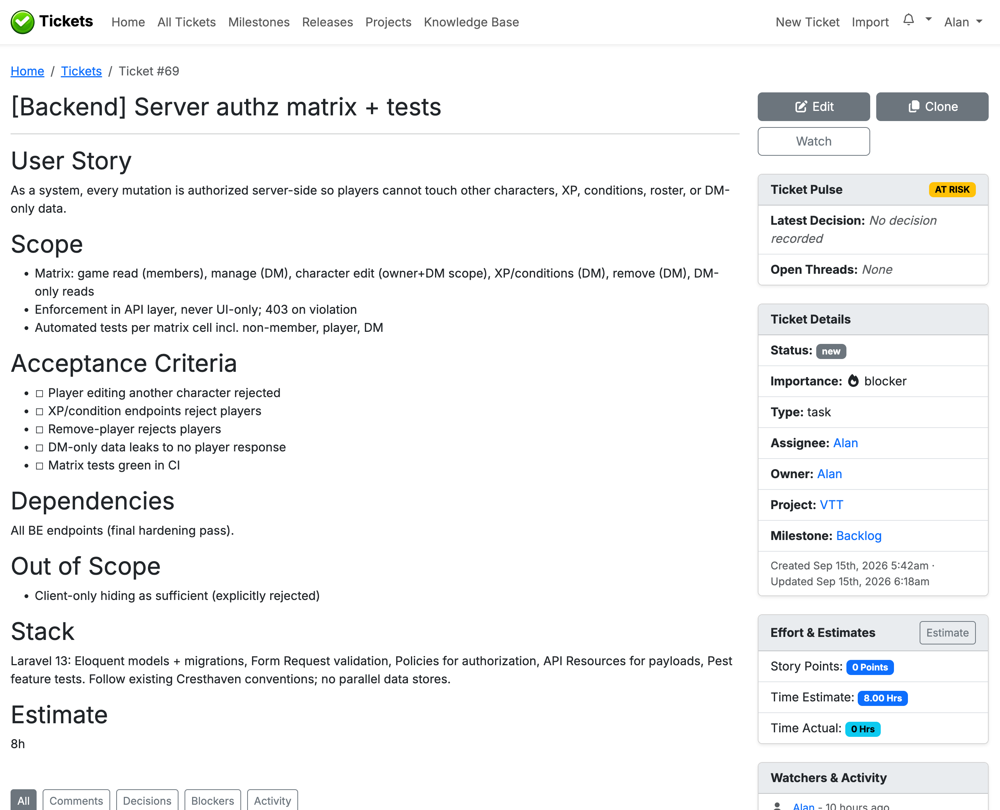
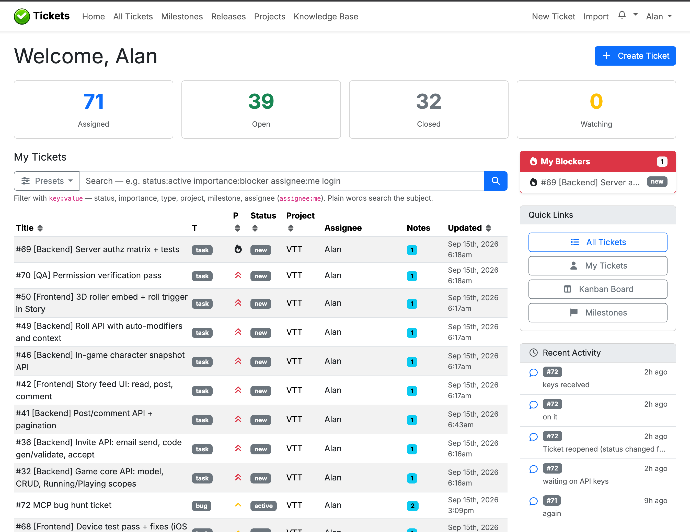
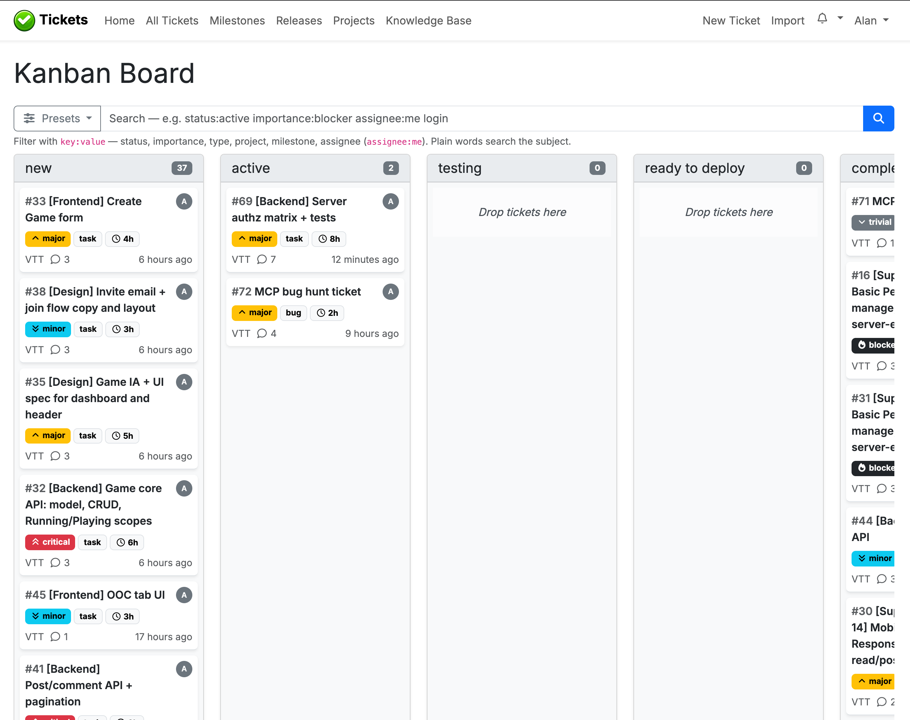
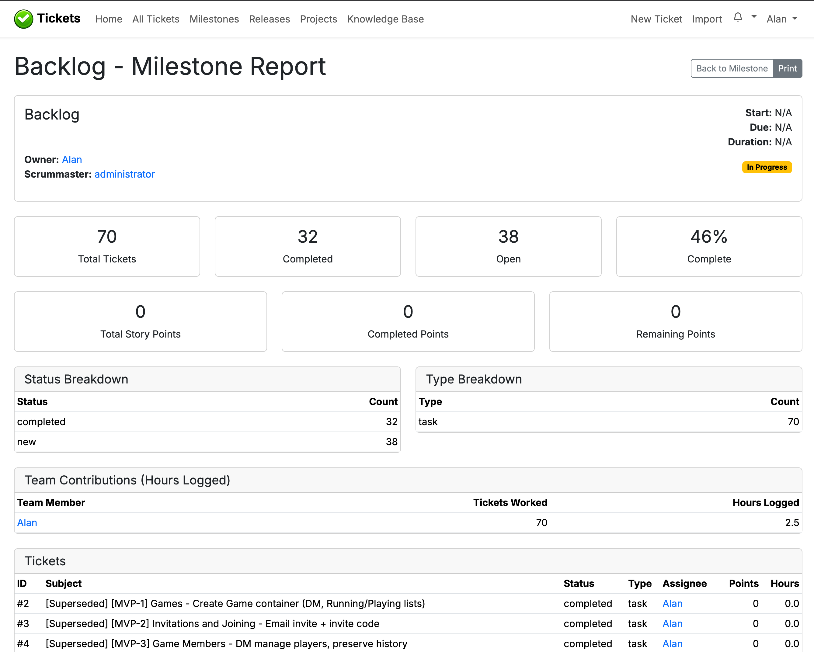

# Tickets

[](https://github.com/velkymx/tickets/releases)
[](LICENSE.md)
[](https://github.com/velkymx/tickets/stargazers)

A self-hosted, open-source issue and sprint tracker for small teams. Tickets combines project management, backlogs, Kanban boards, real-time collaboration, automations, a knowledge base, and a REST API without the complexity of Jira or the cost of Linear.

Built with [Laravel](https://laravel.com), Tickets is designed to be easy to run, easy to understand, and easy to customize.



## Why Tickets?

Tickets is for teams that have outgrown a simple GitHub Issues workflow but do not need the complexity of Jira.

Run it on your own infrastructure, keep your project data under your control, and customize the application to fit the way your team works.

* Self-hosted and open source
* Projects, milestones, releases, backlogs, and sprints
* Kanban boards
* Real-time collaboration
* Built-in knowledge base
* Automations and notifications
* Ticket Pulse for execution visibility
* REST API
* MCP server for AI assistants
* AI agent integration
* Built with Laravel and designed to be extended

## Features

### Issues, Projects & Sprints

Manage the work your team needs to get done.

* Projects with progress tracking, filtered views, and an Action Priority Matrix
* Milestones with reports, burndown charts, and progress tracking
* Releases with ticket association
* Issues with status, type, importance, project, milestone, assignee, due date, estimates, and story points
* Kanban boards with drag-and-drop workflow
* Backlog and sprint management
* Batch ticket updates
* CSV import for bulk ticket creation
* Query-based filtering such as `status:completed assignee:me importance:blocker`
* Search across tickets, projects, milestones, and related data

### Real-Time Collaboration

Keep conversations, decisions, and project context attached to the work.

* Threaded notes and replies
* Decisions, blockers, actions, messages, and updates
* @mention autocomplete
* File attachments
* Markdown editing and live preview
* Slash commands for common actions
* Real-time ticket activity
* Thread resolution and activity tracking

### Knowledge Base

Keep project documentation and team knowledge in the same system as the work.

* Markdown articles
* Categories and tags
* Version history with diff comparison and restore
* Public, internal, and restricted articles
* Per-user permissions
* Full-text search
* File attachments

### Ticket Pulse

See what needs attention without opening every ticket.

Ticket Pulse provides an execution view of your work and surfaces the signals that need attention.

* ON TRACK
* AT RISK
* BLOCKED
* IDLE

Pulse also surfaces blockers, decisions, next actions, and open threads so teams can quickly identify work that needs attention.

### Automation & Notifications

Keep routine project activity moving without constant manual updates.

* Automated project and ticket workflows
* Notifications
* Activity signals
* Queue-based processing
* Configurable notification behavior

### REST API

Tickets includes a token-authenticated REST API for integrations, automation, and custom applications.

The API supports tickets, notes, projects, milestones, releases, users, knowledge base content, Ticket Pulse, and related data.

See the [API documentation](docs/api.md) for the complete reference.

### AI and MCP

Tickets includes a [Model Context Protocol](https://modelcontextprotocol.io/) server for AI assistants and agents.

The MCP endpoint provides tools for working with tickets and the knowledge base using the same Bearer token authentication as the REST API.

The current MCP server provides 16 tools covering:

* Ticket listing and retrieval
* Ticket creation and updates
* Notes and collaboration
* Ticket Pulse
* Knowledge base search
* Knowledge base article management

See the [MCP documentation](docs/mcp.md) for setup and the complete tool reference.

Tickets can also be integrated with AI agent frameworks through the REST API. See the [CrewAI integration example](docs/crewai.md).

## Screenshots

### Dashboard and List View



### Kanban Board



### Ticket Detail


### Milestone Report



## A Simpler Alternative to Jira

Jira is built for organizations that need a highly configurable enterprise project management platform. Tickets takes a different approach.

If your team needs projects, issues, sprints, Kanban boards, collaboration, documentation, and automation without a large administration layer, Tickets gives you a complete self-hosted application you control.

Choose Tickets when you want:

* Your own infrastructure
* Open-source software
* A simpler project management workflow
* A Laravel application you can customize
* No per-user SaaS subscription
* Project data you control
* An integrated knowledge base
* API and AI integrations

Choose Jira when you need its larger enterprise ecosystem, extensive integrations, and enterprise-specific capabilities.

Tickets is not trying to reproduce every feature Jira has. It is designed for teams that want the core project management workflow without the complexity they do not need.

## Tickets vs GitHub Issues

GitHub Issues are excellent for teams that want to keep project tracking entirely inside GitHub.

Tickets is a better fit when you want a dedicated, self-hosted project management application with its own projects, milestones, releases, sprints, Kanban boards, collaboration tools, knowledge base, automation, and API.

If your team wants more structure than GitHub Issues without moving to a large SaaS project management platform, Tickets provides that middle ground.

## Documentation

Tickets includes complete documentation covering installation, administration, workflows, integrations, and the underlying concepts behind the application.

### Concepts

* [Agile Workflow](docs/agile-workflow.md)
* [Note Signals](docs/note-signals.md)
* [Ticket Pulse](docs/pulse.md)

### Administration

* [Installation](docs/installation.md)
* [Projects, Milestones & Releases](docs/projects.md)
* [Users](docs/users.md)
* [Automations](docs/automations.md)
* [Notifications](docs/notifications.md)
* [Knowledge Base](docs/kb-admin.md)
* [CSV Import](docs/csv-import.md)
* [REST API](docs/api.md)

See the complete [documentation index](docs/index.md).

## Quick Start

The fastest way to try Tickets is Docker.

```bash
git clone https://github.com/velkymx/tickets.git
cd tickets
docker compose up -d --build
```

Then open `http://localhost` in your browser.

For complete installation, configuration, Docker deployment, and production hosting instructions, see the [Installation Guide](docs/installation.md).

## Requirements

Tickets is a Laravel application and supports:

* PHP 8.2+
* MariaDB 11.8+
* MySQL 8.0+
* PostgreSQL 12+
* SQLite 3.35+
* Node.js 24+ for building frontend assets

Docker provides the complete application stack for a simpler deployment.

See the [Installation Guide](docs/installation.md) for current requirements and deployment options.

## Built With Laravel

Tickets is built with the Laravel framework and its surrounding ecosystem.

The application uses Laravel for its backend architecture and application services, with a modern web frontend and standard open-source infrastructure.

## Development

Tickets is developed as an open-source Laravel application with automated testing and CI/CD.

To contribute, see the [Contributing Guide](CONTRIBUTING.md).

Found a security issue? See the [Security Policy](SECURITY.md). Please do not open a public issue for security vulnerabilities.

## Roadmap

See the [GitHub Issues](https://github.com/velkymx/tickets/issues) and project discussions for current development, planned features, and future improvements.

## License

Tickets is open-source software licensed under the [MIT License](LICENSE.md).

Copyright Alan Bollinger.
